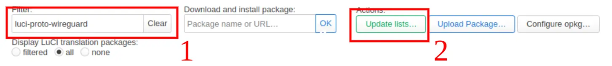
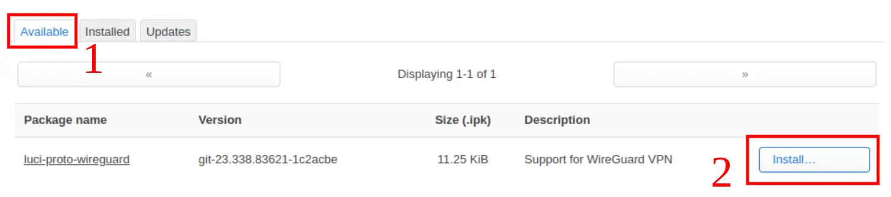
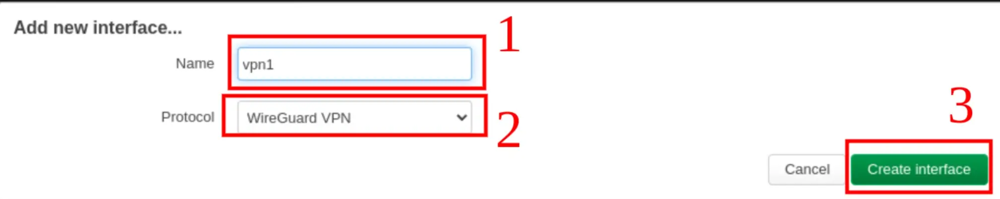
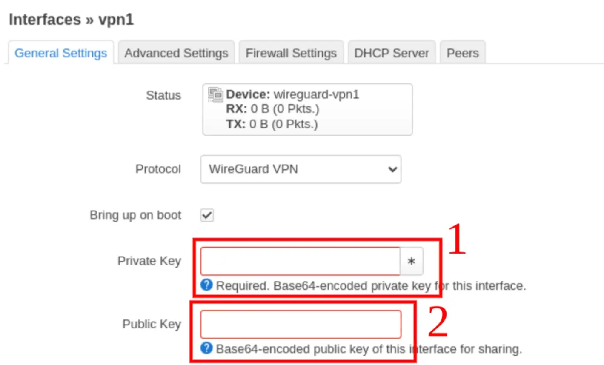
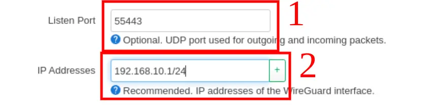
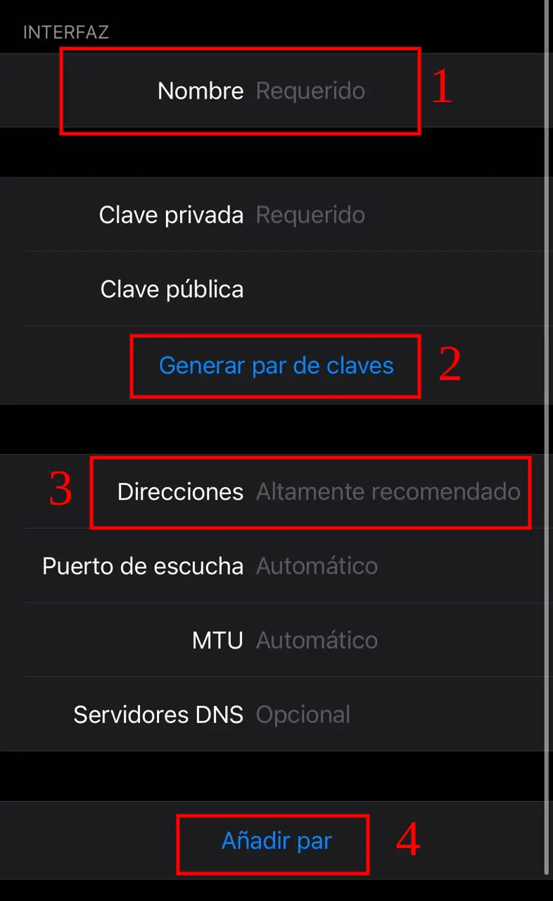
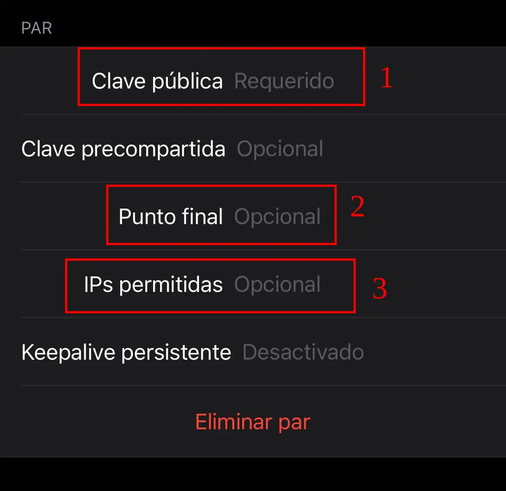
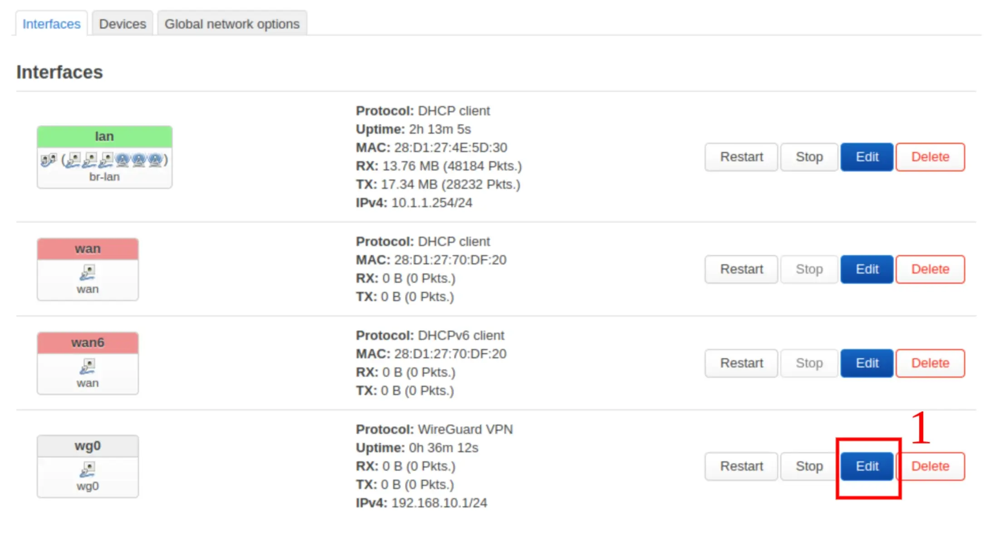
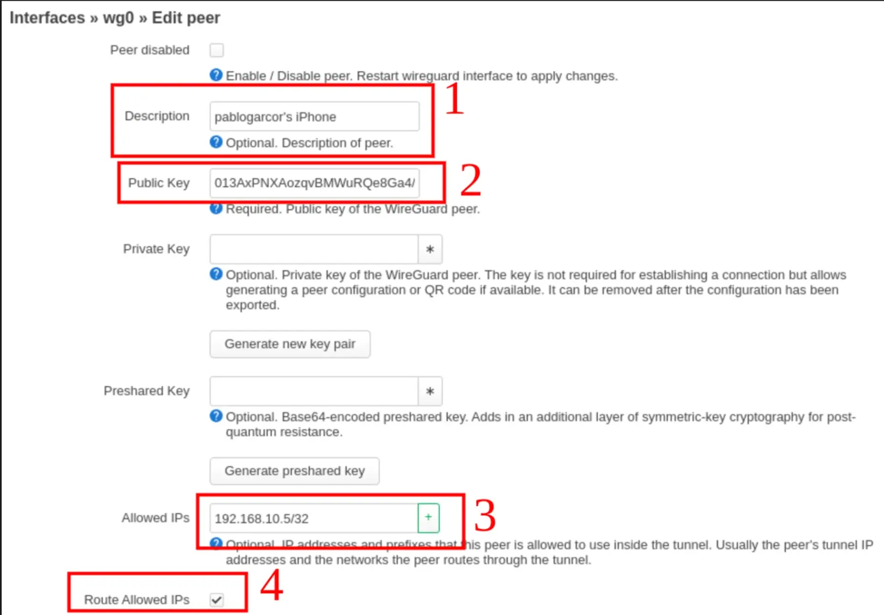
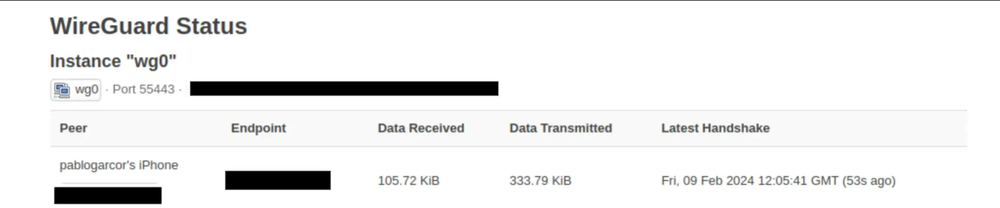

In my quest to access my homelab remotely, I decided to set up a VPN. After evaluating several options, **WireGuard** emerged as the clear winner due to its simplicity, speed, and lightweight nature, perfectly aligning with my needs. It's important to first ensure your network is not under Carrier Grade NAT (CGNAT). A simple call to your ISP can confirm this status, and if necessary, you might need to request a change—though this could incur additional fees.

## WireGuard Installation with LuCI

To install WireGuard, navigate to `System > Software` in the LuCI interface. 
1. Type `luci-proto-wireguard` in the filter box. 
2. Click the "Update list" button.



A popup will appear briefly; close it and then: 
1. Switch to the "Available" tab to view all relevant packages. 
2. Find and click the "Install" button next to `luci-proto-wireguard` to begin installation. Once completed, close the final confirmation popup.



## Key Generation for WireGuard

Generating a private/public key pair is essential for setting up WireGuard. This can be done using the command:

```bash
wg genkey | tee wg.key | wg pubkey > wg.pub
```

Ensure `wireguard-tools` is installed on your device or access your router via SSH to execute this command. Afterward, you'll have `wg.key` (for the router) and `wg.pub` (for client devices). Proceed to `System > Startup` in LuCI.
1. Under the "Initscripts" tab, restart the network script to apply the new settings.


## Network Configuration

Create a dedicated network for the VPN by going to `Network > Interfaces` and selecting "Add new interface". 
1. Name your interface. 
2. Select "WireGuard VPN" as the protocol.
3. Press "Create interface"



After this, fill in the necessary details using the keys generated earlier.
1. The private key is the one in `wg.key` file.
2. The public key is the one in the `wg.pub` file.



1. Assign a listening port.
2. Also add an IP address range for the VPN. 
Ensuring there's no overlap with your existing network segments. Save and reboot the router to apply these settings.



## Configuring VPN Access on a Client Device

Taking an iPhone as an example, download the WireGuard app from the App Store. Create a new tunnel configuration. 
1. Name the interface.
2. generate a new key pair. 
3. Assign the device's IP address within the VPN's subnet, using a /32 mask.
4. Finally click over "Add peer". That will open the peer configuration.



Add the router as a peer in the app. 
1. Using the router's public key (`wg.pub`). 
2. The endpoint is the IP address and the designated port. If accessing the internet remotely is desired, use your external IP address and ensure CGNAT is not a concern.
3. Allowed IPs should be 0.0.0.0 to route all the iPhone traffic over wireguard VPN.



## Finalizing the Router Configuration

Back in the LuCI interface, under `Network > Interfaces`. 
1. Edit the WireGuard interface to add your device as a peer.



1. Add a description of the peer for a better identification.
2. Specify its public key. 
3. Also specify the assigned IP. 
4. Ensure "Route Allowed IPs" is activated for proper routing.



Check connectivity under `Status > Wireguard` in LuCI, where a successful handshake indicates a fully operational VPN setup.



## Conclusion

By following these steps, we've successfully established a basic VPN connection using WireGuard on OpenWrt, facilitating access to a specified subnet. Future enhancements will aim to enable full internet connectivity and inter-network access, expanding the capabilities of our VPN configuration.
