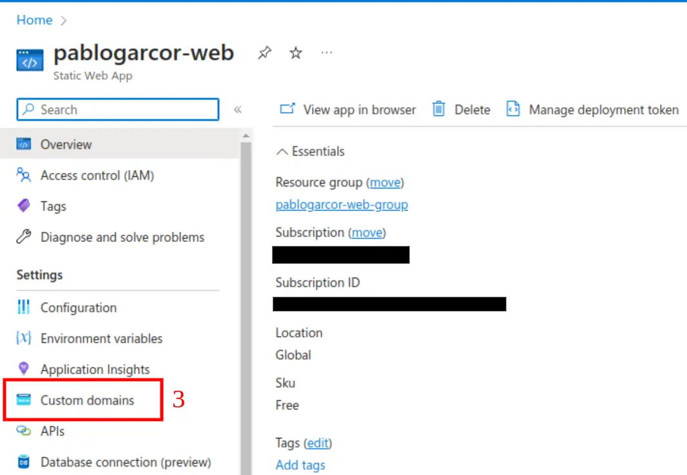
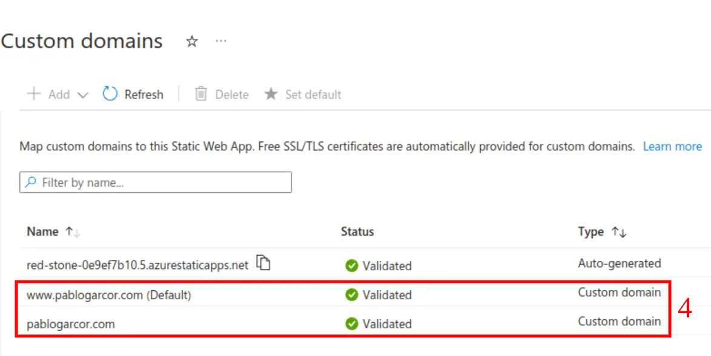
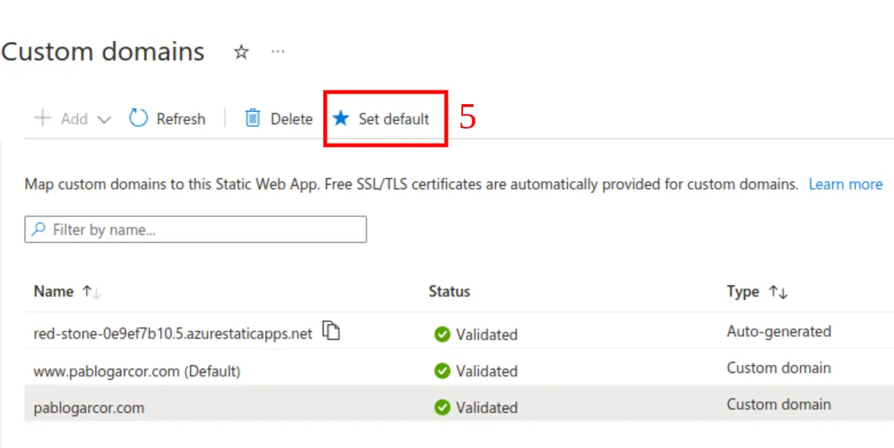

In a [recent blog post](/migrating-website-azure), I detailed my journey of setting up a static webpage using Azure. The process was generally smooth, but I encountered an early hiccup. To minimize expenses for my personal blog, I opted out of using Azure DNS. Instead, I explored redirecting traffic from `pablogarcor.com` to `www.pablogarcor.com` using Namecheap URL redirections, which initially appeared more complex than needed. Fortunately, I found a much simpler method.

## How to Redirect an Apex Domain to www on an Azure Static Web App
Follow this streamlined setup guide:

1. **Log into Azure**.
2. **Access your Static Web App resource**.
3. **Navigate to 'Custom Domain' settings**.

4. In the domain management section, **link both your apex and www domains** to your third-party DNS provider.

5. **Select the www domain as your default domain** by clicking on it.

That's it! Once the www domain is set as the default, Azure automatically manages the rest of the redirection process.

## Conclusion
Although the task was straightforward, finding detailed instructions for this configuration in the Azure documentation was a challenge. I had to do some experimenting on my own, but eventually, the solution was simpler than expected. I hope this guide spares you some of the trial and error that I experienced.
