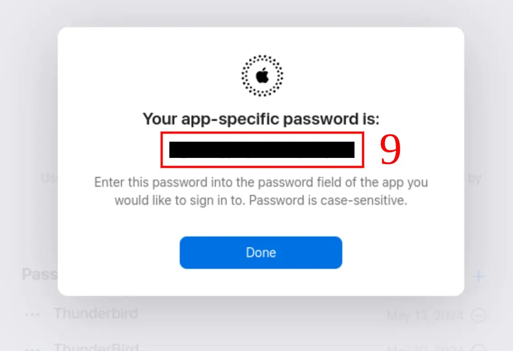
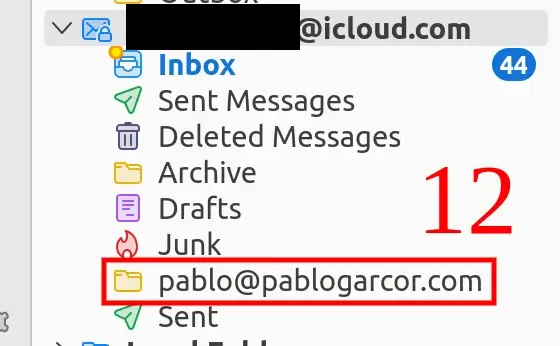

I use a couple of Apple products, but macOS isn’t one of my favorites. On my laptops and PCs, I have different flavors of Linux, and on all of them, I use Thunderbird as my mail client. Some time ago, I migrated my self-hosted mail server to iCloud+ (because it was cheaper and easier), and now I need to add my custom iCloud+ email address in Thunderbird. Here’s how I made it work:

1. Click on any email account or local folder tab.
2. Go to the upper right corner and click on “Account Settings.” This will open a new tab.

3. In the new tab, click on the dropdown “Account Actions” and select “Add Mail Account.”

4. In the Account Setup tab, fill in the details. Pay attention to the password field because you need an Apple app-specific password.
5. Log in to [appleid.apple.com](https://appleid.apple.com/sign-in).
6. Click on the App-specific Passwords button.

7. In the pop-up, click on the cross icon.

8. Enter a name to remember where you are using that password. In this case, I will use Thunderbird and click create. After this, you may be required to enter the password of your iCloud account.
9. The new pop-up will give you the app-specific password. Copy it to a safe place, or you will need to create a new one in the future.

10. Enter your name, iCloud email address, and the app-specific password you copied in the last step, and click on “Continue.”

11. Thunderbird will try to retrieve the IMAP and SMTP configuration of the iCloud+ mail server. You just need to click on “Done.”

12. After completing these steps, close Thunderbird. When you open it again, you will see your custom email as one of your iCloud inboxes.

### Conclusions

Adding a custom iCloud+ email is just like configuring any other email but requires an Apple app-specific password to work. If you use your iCloud password, it won’t work.
