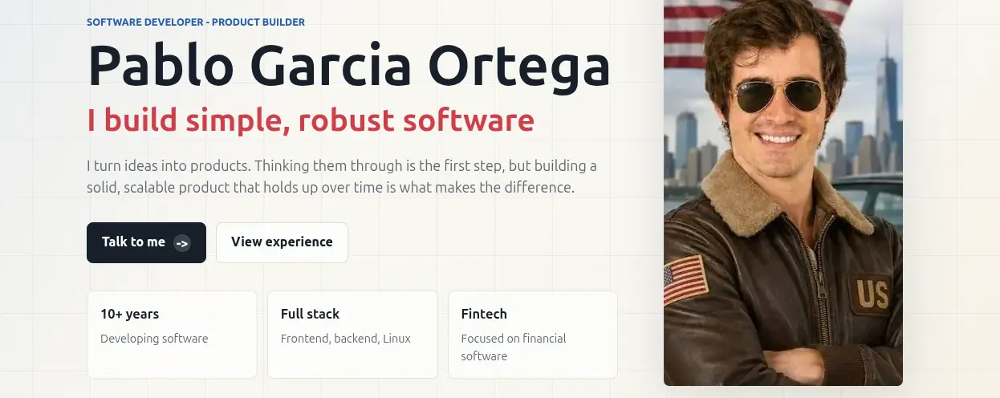

Some time ago I wrote that I wanted to rank my name in Google. I searched for my name, Pablo Garcia Ortega, and the first results were not really about me. It was a bit annoying, and also a small ego hit, because I have been building things online for years but my own name was not under my control.

Now I finally created a specific personal page for that. It is not a big portfolio or a complicated website. It is more like a simple CV page, with my name, what I do, some context about my work.

The site is:

* [pablogarciaortega.com](https://pablogarciaortega.com/)
* [pablogarciaortega.com/es](https://pablogarciaortega.com/es/)



The main version is in English and there is also a Spanish version. My goal is simple: when someone searches for "Pablo Garcia Ortega", Google should understand that this website is the main page about me.

## Why I Created Another Page

I already have this blog, but the blog is not exactly a CV. It has posts, experiments, personal opinions, technical notes, and other things. That is fine, but it is not the clearest page for a search engine or for someone who only wants to know who I am.

So I wanted a cleaner page with only one goal:

* show my full name
* explain what i do
* and make the content available in English and Spanish

It is a small page, but sometimes small pages are better when the purpose is very specific.

## The SEO Plan

I asked ChatGPT for a practical SEO plan for a bilingual personal website. I did not want a generic list of "write quality content" and "build authority". I wanted concrete things I could do in a few hours.

The plan was basically this.

## 1. Add the Site to Search Console

The first step is Google Search Console. Without it, you are almost blind.

I need to add `pablogarciaortega.com` as a domain property, submit the sitemap, and ask Google to inspect these URLs:

* `https://pablogarciaortega.com/`
* `https://pablogarciaortega.com/es/`

This does not guarantee ranking. It does not even guarantee indexing. But it gives me a place to see if Google can crawl the site, if there are canonical problems, or if the pages are discovered but not indexed.

## 2. Make the Titles and Descriptions Obvious

For a personal page, the name must be very clear. Not hidden in a paragraph, not only inside a logo, and not replaced by a clever headline.

For the English version I want something like:

```html
<title>Pablo Garcia Ortega | Software Developer & Product Builder</title>
<meta name="description" content="Pablo Garcia Ortega is a software developer and product builder focused on simple, robust software, fintech, full-stack development and automation.">
```

For the Spanish version:

```html
<title>Pablo Garcia Ortega | Desarrollador de software</title>
<meta name="description" content="Pablo Garcia Ortega es desarrollador de software y creador de productos, especializado en software robusto, fintech, full stack, automatización y sistemas simples.">
```

This is not creative, but that is the point. Google and people should understand the page in two seconds.

## 3. Use Canonical URLs and Hreflang

Because the page exists in English and Spanish, I also need to tell Google that both versions are connected.

The English page should point to itself as canonical, and the Spanish page should point to `/es/` as canonical. Then both pages should include `hreflang` links:

```html
<link rel="alternate" hreflang="en" href="https://pablogarciaortega.com/">
<link rel="alternate" hreflang="es" href="https://pablogarciaortega.com/es/">
<link rel="alternate" hreflang="x-default" href="https://pablogarciaortega.com/">
```

I do not expect this to be magic, but it helps Google understand that these are language alternatives, not duplicated pages competing with each other.

## 4. Add Structured Data for a Person

This is one of the parts I like more, because it is very explicit. With JSON-LD I can tell search engines that the page is about a person, not only a random website.

The important fields are the name, the URL, the job title, what I know about, and especially `sameAs`.

`sameAs` is where I can connect this website with profiles that already exist, like LinkedIn, GitHub, or other public accounts. That is important because Google needs consistency. If my site says one thing, my LinkedIn says another, and my GitHub links to an old domain, the signal is weaker.

## 5. Keep a Simple Sitemap and Robots File

This website does not need anything fancy. A sitemap with the two main URLs is enough:

* `https://pablogarciaortega.com/`
* `https://pablogarciaortega.com/es/`

And `robots.txt` should allow crawling and point to the sitemap.

Again, this is basic, but basic things are easy to forget when the site is small.

## 6. Add External Signals

This is probably the most important part after the technical setup.

If I want Google to believe that `pablogarciaortega.com` is my main personal website, I should link to it from places that already have some authority:

* LinkedIn
* GitHub
* my GitHub profile README
* email signature
* project pages
* other public profiles I really use

I dont think I need hundreds of backlinks for my own name. But I do need some consistent links from real profiles. For a name search, that can be enough.

## 7. Make the Content Match the Search

The page should not be over-optimized, but it should say clearly who I am.

It sounds obvious, but that is exactly what I want. If the query is my full name, the page has to answer who Pablo Garcia Ortega is.

## What I Expect

I do not expect instant results. Google can discover a page fast, but ranking can take weeks or months.

My realistic expectation is:

* first, get the pages indexed
* then appear when searching `site:pablogarciaortega.com`
* then start appearing for "Pablo Garcia Ortega"
* and later try to reach the first positions.

If everything is technically correct and I add links from my real profiles, I think the first signs can appear in a few weeks. Maybe serious results take one to three months. That is fine. This is not a paid campaign, it is more like building a small identity signal and letting Google connect the dots.

## Conclusion

This project is not only about SEO. It is also about owning a little more of my identity online.

LinkedIn, GitHub, Twitter, old profiles, company pages, and random websites can appear when someone searches your name. That is normal. But I prefer that my own domain is the main result, because it is the place I control.

Now the page exists. The next step is not to overthink it, but to connect it properly, submit it to Search Console, link it from my real profiles, and check the results with some patience.

I will see in a few weeks if Google agrees with me
