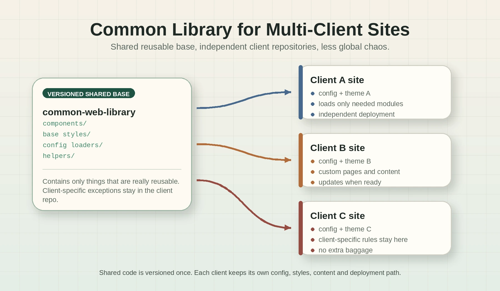

Lately I have been thinking about multi-client websites. I mean those projects where the base product is more or less the same, but every client needs their own configuration, their own styles, maybe different sections, different texts, different colors, and some specific behavior

The first idea that usually appears is to create one big repository with everything inside. One repo, many clients, many folders, many conditions. It sounds clean at the beginning because everything is in one place.

But after some time, at least in my experience, it starts to become a little monster

You add one configuration for client A, then a special case for client B, then client C needs a different layout, then client D has an old design that cannot be touched. Suddenly the code is full of `if client is this`, `if feature is enabled`, `if theme is old`, `if region is that`

It works, yes. But it becomes harder to understand and easier to break.

This is the idea visually:



## The Big Multi-Client Repo Problem

A big multi client repo can look practical because all clients share the same code. The problem is that they also share the same chaos.

Every change needs more mental checks:

* Will this break another client?
* Is this style used only here or also in three other places?
* Can I remove this config or is some old client still depending on it?
* Why does this component have five variants??
* Why is this simple page loading so many things it does not need?

That kind of repo usually grows in a way that nobody really planned. It is not one clean product with clients. It becomes a collection of exceptions.

For small teams, this is especially painful. You spend too much time understanding the shared mess and not enough time building the thing the client actually needs.

## A Common Library Feels Cleaner

What I prefer is a different approach, create a common library with the shared logic, components, helpers, defaults, and base styles. Then every client has its own repository and loads only what it needs from that library.

So instead of having one massive repo like this:

```text
big-platform/
  clients/
    client-a/
    client-b/
    client-c/
  shared/
  many-configs/
  many-conditions/
```

I prefer something more like this:

```text
common-web-library/
  components/
  styles/
  config-loaders/
  helpers/

client-a-site/
  config/
  styles/
  pages/

client-b-site/
  config/
  styles/
  pages/
```

The shared library gives the base. The client repo decides what to use, what to override, and what to leave out.

For me this is much easier to reason about.

## Each Client Owns Its Configuration

Client configuration should live close to the client

If client A needs a specific menu, a specific color palette, or some custom metadata, that should be in the client A repo. Not hidden somewhere in a giant config file with 200 other clients.

This makes the project more explicit. When I open the repository of a client, I can see what that client is using. I do not need to mentally filter the whole platform.

Also, deployments are cleaner. If I change client A, I can deploy client A. I do not need to touch the full multi-client system unless the shared library itself changed.

That separation reduces fear. And fear is a real cost in software development.

## Styles Are Better When They Are Not All Mixed

Styles are one of the first things that become painful in multiclient projects.

At the beginning, there is a base CSS file and a few variables. Nice. Then one client needs rounded cards, another one needs a darker header, another one uses different spacing, and another one has a totally different homepage.

If all of that lives in the same repo, the css starts to have too many layers. You end with base styles, overrides, client overrides, old overrides, emergency overrides, and comments explaining why nobody should touch some selector.

With a common library, the base style can be shared, but each client can load its own theme and only override what it really needs.

That is more boring, but boring is good here

## It Gives More Versatility

An independent client repo gives more freedom.

Maybe one client needs a very simple site with only three pages. Another one needs a heavier structure. Another one wants an experiment that should not affect the others.

If all of them are inside the same repo, every decision feels global. Even when it is not global, it feels like it could be.

With a common library, the common parts stay common, but each client can move at its own speed.

That is useful when clients are not identical. And usually they are never identical for long.

## The Library Must Stay Disciplined

Of course, this approach is not magic.

The common library can also become a mess if every client-specific thing is pushed into it. That is the main risk. The library should contain what is really reusable, not every weird requirement that appeared once.

For me, a good rule is simple:

* If several clients need it, it can probably live in the common library.
* If only one client needs it, it should probably stay in that client repo.
* If we are not sure yet, keep it local first and extract it later.

Extracting shared code later is usually better than creating an abstraction too early. Early abstractions feel clever, but sometimes they only make the next change harder.

## When a Single Multi-Client Repo Still Makes Sense

I dont think a multi client repo is always wrong.

If all clients are really just configurations of the same product, with almost no custom behavior, a single repo can be fine. It can even be simpler.

It also makes sense when the team needs atomic changes across all clients all the time, or when the deployment process is designed around one platform release.

But if every client starts to need its own design decisions, its own content structure, or its own weird business rules, I prefer to separate.

The important thing is not having many repos or one repo. The important thing is reducing complexity where the developers actually work every day.

## Conclusion

For multi client sites, I prefer a common library plus independent client repositories.

It keeps the shared parts reusable without forcing all clients to live inside the same giant codebase. It also makes configuration and styles easier to understand, because each client loads what it needs instead of carrying the weight of all the others.

It is not perfect. You need discipline in the common library and you need a clean way to version and update it. But for me, it is less chaotic, more versatile, and easier to develop.

Sometimes the best architecture is not the one that puts everything together. Sometimes it is the one that lets every part have its own space
