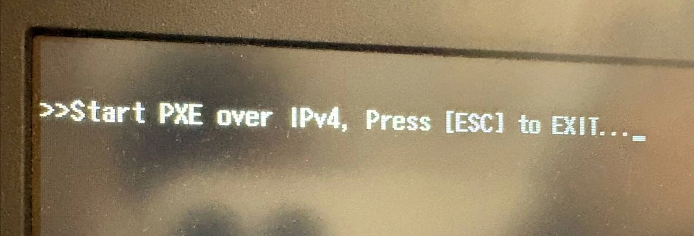
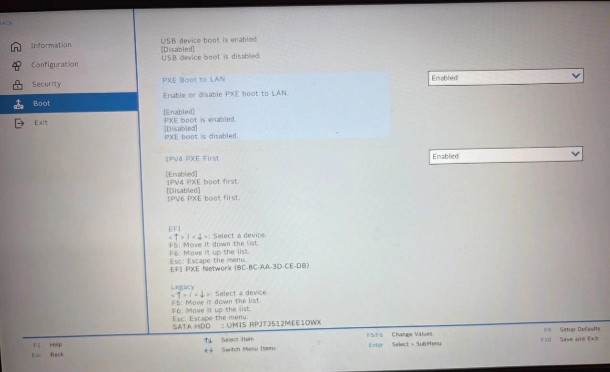
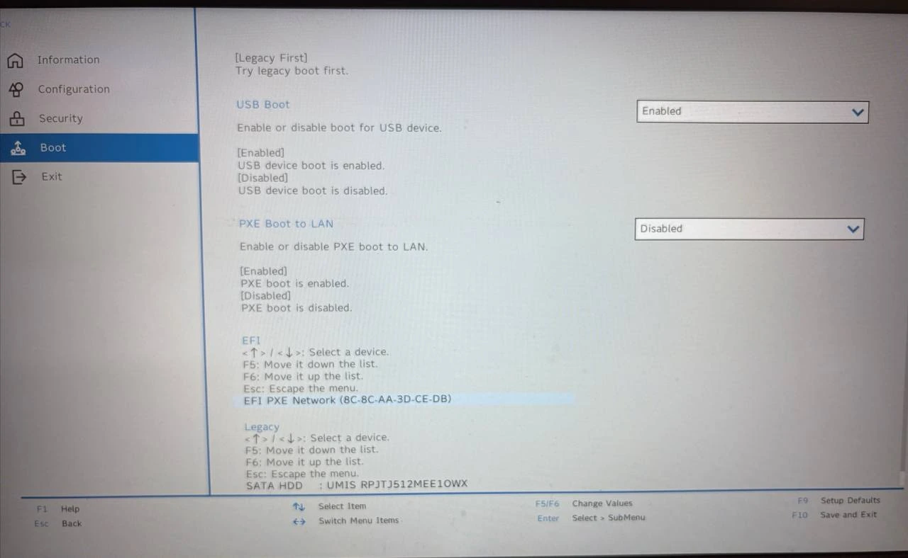

Some time ago I installed Ubuntu 24.04 on my Lenovo ddeapad 3 gaming laptop. Every day they put more ridiculous names to laptops, but anyway.

The thing is that, after installing it, some config was probably changed somewhere. I dont know exactly where, but every time I started the laptop I saw this message:

Nothing was really broken. I pressed `Esc`, the laptop continued its way, and it booted from the HDD as always.

But the message was there every time. It was not dramatic, but it was annoying enough.

## What Was Happening

The problem was only a boot option. Nothing more

PXE is used to boot from the network. That can be useful in some environments, but I don't need it on this laptop. In my case, the BIOS had `PXE Boot to LAN` enabled, so the laptop was trying to start from the network before continuing with the normal disk boot

This was the configuration causing the message:

I am not very proud of this, but because of laziness and because pressing `Esc` was easy enough, I left it like that for too much time.

After finally repeating myself "do not leave for tomorrow what you can do today", I entered the BIOS and fixed it

## Enter the BIOS

First you need to enter the laptop BIOS.

In my Lenovo laptop, I have to press `F2` on the initial Lenovo screen. Maybe in other laptops it is another key, but for this one `F2` is the one.

## Disable PXE Boot to LAN

Once inside the BIOS, go to the `Boot` options.

There, look for `PXE Boot to LAN` and change it from `Enabled` to `Disabled`.

This is the same setting after changing it:

After that, go to `Exit` and choose the option to save and exit. In this BIOS you can also use `F10` for save and exit.

And... done

## Conclusion

Sometimes the idea of doing something is harder than the thing itself.

I think it took me more time to write this small guide than to fix the problem in the BIOS. But well, now it is solved, and I can finally stop wasting the `Esc` key stupidly every time I turn on the laptop
