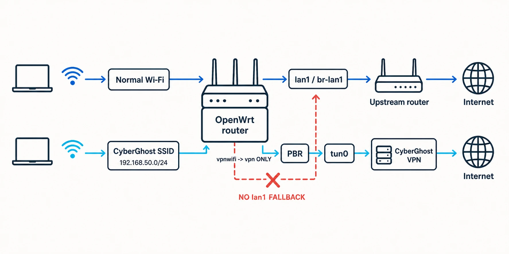

> **Update — July 30, 2026:** After publishing this guide, I found a DNS problem in the final hardened configuration: clients could still reach Internet addresses by IP, but domain names stopped working after reconnecting to the SSID. [Jump to the updated DNS fix.](#update-july-30-2026-dns-fix-after-hardening-the-firewall)

I wanted one WiFi network at home to always use CyberGhost, but I did not want to send all my home traffic through the VPN.

My normal devices had to continue using the ISP connection. Only the devices connected to a dedicated SSID called `CyberGhost` should go through OpenVPN.

I also wanted it to fail closed. If the VPN tunnel stopped, the clients on that SSID had to lose Internet access instead of falling back to the normal connection. Otherwise I could think that a device was using the VPN when it was not, and that was not what I was looking for

The idea sounded simple: create another WiFI network and send it to the VPN. Well, it was not so simple.

During the process I managed to add a gateway pointing to the router itself and I lost normal access to it. I also found that `scp` was trying to use SFTP, and that PBR expected an interface called `wan` that does not exist in my setup.

This is the final configuration that worked for me. I am including the errors because they are probably the most useful part.

> This guide describes my Xiaomi AX3600 running OpenWrt `24.10.7` with `pbr` `1.2.2-r20`. Interface names and subnets can be different on another router, so check your own configuration before copying commands.

## What I Wanted to Build

These were my rules:

* The normal default route must stay through my first router, `10.1.1.1`.
* Only clients from `192.168.50.0/24` must use CyberGhost.
* OpenVPN must not replace the global default route.
* The vpn WIFI must only forward to the VPN firewall zone.
* If `tun0` disappears, the VPN WIFI must have no Internet.
* The normal LAN and WiFi must continue working if CyberGhost is down.

This is the final traffic flow:



My network uses two routers. I will call them R1 and R2:

```text
Internet
  |
R1: 10.1.1.1
  |
R2: Xiaomi AX3600 with OpenWrt
  |
  +-- uplink: lan1 / br-lan1 / 10.1.1.2/24
  +-- normal LAN: br-lan / 10.10.10.1/24
  +-- VPN tunnel: tun0
  +-- VPN Wi-Fi: br-vpnwifi / 192.168.50.1/24
```

The `tun0` address is assigned by the VPN and can change. Do not hardcode an address observed in one OpenVPN session.

## 1. Make a Backup Before Touching Routes

Network and firewall changes can make the router inaccessible very easily. I learned this in the practical way.

Before changing anything, I copied the important configuration files:

```sh
cp /etc/config/network /root/network.ok
cp /etc/config/dhcp /root/dhcp.ok
cp /etc/config/firewall /root/firewall.ok
cp /etc/config/wireless /root/wireless.ok
```

If PBR is already installed and `/etc/config/pbr` exists, copy it too:

```sh
cp /etc/config/pbr /root/pbr.ok
```

It is also a good idea to export a full backup from `System -> Backup / Flash Firmware -> Generate archive` in LuCI.

If possible, have an Ethernet cable close. Wi-Fi is not the best recovery plan when you are changing the Wi-Fi network itself.

## 2. Install OpenVPN and PBR

On OpenWrt `24.10.x`, I installed the OpenVPN and policy-based routing packages with `opkg`:

```sh
opkg update
opkg install openvpn-openssl luci-app-openvpn pbr luci-app-pbr
```

I did not run a blind `opkg upgrade`. I only needed four packages, and updating everything could create a completely different problem.

## 3. Download the CyberGhost OpenVPN Files

From my Cyberghost account I created a manual OpenVPN configuration. The downloaded files were:

```text
openvpn.ovpn
ca.crt
client.crt
client.key
```

CyberGhost also generated a username and password for OpenVPN. They are not necessarily the same username and password used to log in to the website or app.

### An Error: `scp` Tried to Use SFTP

When I tried to copy the files, I found this:

```text
ash: /usr/libexec/sftp-server: not found
scp: Connection closed
```

Modern versions of `scp` use SFTP by default, but my OpenWrt installation with Dropbear did not have that SFTP server.

The fix was adding `-O` to force the old SCP protocol:

```sh
scp -O openvpn.ovpn ca.crt client.crt client.key root@10.10.10.1:/etc/openvpn/
```

Then, on the router, I protected the private key:

```sh
chmod 600 /etc/openvpn/client.key
```

## 4. Configure OpenVPN Without Routing Everything Through It

I used `cyberghost.conf` as the profile name. If the downloaded file is called `openvpn.ovpn`, it can be renamed with:

```sh
mv /etc/openvpn/openvpn.ovpn /etc/openvpn/cyberghost.conf
```

Then I created the authentication file:

```sh
umask 077
vi /etc/openvpn/cyberghost.auth
```

Its content is only the generated OpenVPN credentials, one per line:

```text
CYBERGHOST_GENERATED_USERNAME
CYBERGHOST_GENERATED_PASSWORD
```

And I set its permissions:

```sh
chmod 600 /etc/openvpn/cyberghost.auth
```

Inside `/etc/openvpn/cyberghost.conf`, I used absolute paths:

```text
ca /etc/openvpn/ca.crt
cert /etc/openvpn/client.crt
key /etc/openvpn/client.key
auth-user-pass /etc/openvpn/cyberghost.auth
```

The most important line for this split-routing setup is:

```text
pull-filter ignore "redirect-gateway"
```

This prevents a `redirect-gateway` pushed by the VPN server from replacing the normal route of the router.

If the downloaded profile contains an explicit line like this:

```text
redirect-gateway def1
```

remove it or comment it. `pull-filter` ignores a pushed option, but it does not remove a line already written in the local configuration.

After that I enabled and restarted OpenVPN:

```sh
service openvpn enable
service openvpn restart
```

And checked the tunnel, the log and the routes:

```sh
ip addr show tun0
logread -e openvpn | tail -30
ip route
```

The OpenVPN log should contain:

```text
Initialization Sequence Completed
```

More importantly, my normal default route still had to be:

```text
default via 10.1.1.1 dev br-lan1
```

These routes would be bad signs for this design:

```text
default dev tun0
0.0.0.0/1 dev tun0
128.0.0.0/1 dev tun0
```

They make sense for a complete-router VPN, but not for what I wanted.

I checked this route after every important change. Seeing `tun0` up is not enough if the router also forgot how to reach the normal Internet.

## 5. Declare `tun0` as an OpenWrt Interface

OpenVPN creates `tun0`, but I also needed a logical OpenWrt interface so the firewall and PBR could refer to it.

I named that interface `vpn`:

```sh
uci -q delete network.vpn
uci set network.vpn='interface'
uci set network.vpn.proto='none'
uci set network.vpn.device='tun0'
uci commit network
service network reload
```

Then I verified both the logical interface and the tunnel device:

```sh
ubus call network.interface.vpn status
ip addr show tun0
```

## 6. Create the Isolated VPN Wi-Fi Network

First I created an empty bridge named `br-vpnwifi`:

```sh
uci -q delete network.vpnwifi_dev
uci set network.vpnwifi_dev='device'
uci set network.vpnwifi_dev.type='bridge'
uci set network.vpnwifi_dev.name='br-vpnwifi'
uci set network.vpnwifi_dev.bridge_empty='1'
```

Then I created a static interface named `vpnwifi`:

```sh
uci -q delete network.vpnwifi
uci set network.vpnwifi='interface'
uci set network.vpnwifi.proto='static'
uci set network.vpnwifi.device='br-vpnwifi'
uci set network.vpnwifi.ipaddr='192.168.50.1/24'
uci set network.vpnwifi.defaultroute='0'
uci commit network
service network reload
```

Immediately after reloading the network, I checked the route table:

```sh
uci show network.vpnwifi
ubus call network.interface.vpnwifi status
ip route
```

The important routes were:

```text
default via 10.1.1.1 dev br-lan1
192.168.50.0/24 dev br-vpnwifi
```

### The Big Error: Adding the Router as Its Own Gateway

At one point I configured this:

```text
network.vpnwifi.gateway='192.168.50.1'
```

It looked reasonable for one second because `192.168.50.1` is the gateway that Wi-Fi clients use. But for the router itself, `192.168.50.1` is the router. I was telling it to use itself as a gateway.

That produced this route:

```text
default via 192.168.50.1
```

And normal access to R2 stopped working. Very useful.

If the router is still accessible, remove the bad gateway immediately:

```sh
uci delete network.vpnwifi.gateway 2>/dev/null
uci set network.vpnwifi.defaultroute='0'
uci commit network
service network reload
ip route
```

The `vpnwifi` interface needs an IP address, but it must not have a default gateway.

### Recovering with OpenWrt Failsafe

In my case the bad route was enough to require a failsafe recovery. The exact button timing and recovery interface can depend on the router, but the general process was:

1. Disconnect R1 and the other clients from R2.
2. Connect a computer to R2 by Ethernet.
3. Give the computer a static address such as `192.168.1.10/24`, with no gateway.
4. Reboot R2 and trigger the OpenWrt failsafe window with the reset button.
5. Check that `192.168.1.1` answers and connect with `ssh root@192.168.1.1`.
6. Make the writable root filesystem available:

```sh
mount_root
```

The important recovery action is to inspect `/etc/config/network` and remove the self-referential gateway. If necessary, temporarily disable `vpnwifi` and PBR before rebooting:

```sh
uci delete network.vpnwifi.gateway 2>/dev/null
uci set network.vpnwifi.defaultroute='0'
uci set network.vpnwifi.auto='0'
uci set pbr.config.enabled='0'
uci commit network
uci commit pbr
reboot -f
```

Those last commands are recovery examples, not something to copy without checking the current state. If the normal LAN was also modified, restore it from the backup made at the beginning.

The `auto='0'` value above is only temporary. Before rebuilding the VPN WiFi, remove it so the interface can start normally again:

```sh
uci -q delete network.vpnwifi.auto
uci commit network
```

Once I had access again, I rebuilt the VPN Wi-Fi layer by layer and checked `ip route` after every network change. A little repetitive, yes, but better than entering failsafe two times.

## 7. Add DHCP and the CyberGhost SSID

I configured DHCP for the isolated subnet:

> **Updated July 30, 2026:** The `dhcp_option` line below is part of the correction. I originally described public DNS as optional, but that was wrong once the firewall input policy was changed to `REJECT`. [The full explanation is in the update below.](#update-july-30-2026-dns-fix-after-hardening-the-firewall)

```sh
uci -q delete dhcp.vpnwifi
uci set dhcp.vpnwifi='dhcp'
uci set dhcp.vpnwifi.interface='vpnwifi'
uci set dhcp.vpnwifi.start='100'
uci set dhcp.vpnwifi.limit='150'
uci set dhcp.vpnwifi.leasetime='12h'
uci set dhcp.vpnwifi.dhcpv4='server'
uci set dhcp.vpnwifi.force='1'
uci set dhcp.vpnwifi.ignore='0'
uci add_list dhcp.vpnwifi.dhcp_option='6,1.1.1.1,1.0.0.1'
uci commit dhcp
service dnsmasq restart
```

This gives clients addresses starting at `192.168.50.100` and advertises `1.1.1.1` and `1.0.0.1` as their DNS servers. DHCP option `6` is the DNS server option.

Do not add the same DHCP option several times.

For the wireless part, I used LuCI:

1. Go to `Network -> Wireless`.
2. Add an access point on the radio you want to use.
3. Set the SSID to `CyberGhost`.
4. Attach it to the `vpnwifi` network only.
5. Configure WPA2/WPA3 security as appropriate.

The word **only** is important here. If the SSID is also attached to `lan`, the isolation is already wrong before PBR even enters the story.

## 8. Make DHCP Work Before Hardening the Firewall

During the initial test I created a permissive input policy for the new zone. This removed the firewall as one possible reason for DHCP not working:

```sh
uci -q delete firewall.vpnwifi
uci set firewall.vpnwifi='zone'
uci set firewall.vpnwifi.name='vpnwifi'
uci add_list firewall.vpnwifi.network='vpnwifi'
uci set firewall.vpnwifi.input='ACCEPT'
uci set firewall.vpnwifi.output='ACCEPT'
uci set firewall.vpnwifi.forward='REJECT'
uci commit firewall
service firewall restart
```

At this point a connected client should receive:

```text
Address: 192.168.50.x/24
Gateway: 192.168.50.1
```

### The WiFi Connected but Had No IPv4

Another problem I found was a client that connected to the SSID but only had an IPv6 link-local address like `fe80::...`. There was no `192.168.50.x` address.

That is a DHCP or local network problem, not a reason to start changing PBR. I checked it in this order:

```sh
ubus call network.interface.vpnwifi status
uci show dhcp.vpnwifi
service dnsmasq status
uci show firewall.vpnwifi
uci show wireless | grep -E "ssid|network"
```

The interface must own `192.168.50.1/24`, DHCP must listen on `vpnwifi`, the SSID must be attached to `vpnwifi`, and the temporary firewall input policy must allow the client to reach the router.

If the interface status contains an empty IPv4 list:

```json
"ipv4-address": []
```

restore its static configuration before continuing:

```sh
uci set network.vpnwifi.proto='static'
uci set network.vpnwifi.device='br-vpnwifi'
uci set network.vpnwifi.ipaddr='192.168.50.1/24'
uci set network.vpnwifi.defaultroute='0'
uci commit network
service network reload
```

Once DHCP worked, I hardened the zone and allowed only DHCP input:

```sh
uci -q delete firewall.vpnwifi_dhcp
uci set firewall.vpnwifi_dhcp='rule'
uci set firewall.vpnwifi_dhcp.name='Allow-DHCP-VPNWiFi'
uci set firewall.vpnwifi_dhcp.src='vpnwifi'
uci set firewall.vpnwifi_dhcp.proto='udp'
uci set firewall.vpnwifi_dhcp.dest_port='67'
uci set firewall.vpnwifi_dhcp.family='ipv4'
uci set firewall.vpnwifi_dhcp.target='ACCEPT'

uci set firewall.vpnwifi.input='REJECT'
uci commit firewall
service firewall restart
```

The final configuration in this article does not open TCP/UDP port `53` from `vpnwifi` to the router. Clients use the public DNS servers advertised by DHCP instead.

## Update July 30 2026: DNS Fix After Hardening the Firewall

On July 29, after I thought the setup was finished, the `CyberGhost` Wi-Fi looked broken again. A client joined the SSID, received an address such as `192.168.50.120/24`, and had the expected gateway:

```text
default via 192.168.50.1
```

However, websites did not load and DNS returned errors such as `SERVFAIL` or `connection refused`.

The important detail was that this was not a complete loss of connectivity. A direct ping to a public IP still worked:

```sh
ping -c 3 1.1.1.1
```

Queries sent explicitly to public DNS servers also worked:

```sh
nslookup openwrt.org 1.1.1.1
nslookup openwrt.org 1.0.0.1
```

But a query sent to the router failed:

```sh
nslookup openwrt.org 192.168.50.1
```

On OpenWrt, `dnsmasq` was listening on `192.168.50.1:53`, but the hardened firewall zone had:

```text
firewall.vpnwifi.input='REJECT'
```

There was no input rule allowing port `53`. During the earlier setup, `vpnwifi.input='ACCEPT'` had allowed clients to use the router as DNS. After hardening the zone, DHCP could still give `192.168.50.1` to a client as its implicit DNS server, but the firewall rejected the queries.

An older DHCP lease, temporary DNS configuration or client cache can hide this problem for a while. That is why it became visible only after reconnecting to the Wi-Fi.

The fix I applied was to replace any existing DNS option and explicitly advertise public DNS servers:

```sh
uci -q delete dhcp.vpnwifi.dhcp_option
uci add_list dhcp.vpnwifi.dhcp_option='6,1.1.1.1,1.0.0.1'
uci commit dhcp
service dnsmasq restart
```

Then the client must renew its DHCP lease. Disconnecting and reconnecting to the SSID is enough. On my Linux client with NetworkManager I used:

```sh
nmcli device disconnect wlp4s0
nmcli device connect wlp4s0
resolvectl status wlp4s0
```

The last command should show:

```text
DNS Servers: 1.1.1.1 1.0.0.1
```

With this correction, DNS requests are still normal client traffic from `192.168.50.0/24`, so PBR sends them through `tun0` like the rest of the traffic. The firewall remains hardened, and the kill switch is not weakened.

Another possible solution is to open TCP/UDP port `53` from `vpnwifi` to the router and use OpenWrt as DNS. I did not choose that final configuration. Requests forwarded by `dnsmasq` become traffic originated by the router and could use the normal `lan1` uplink unless an additional policy forces and verifies them through the VPN. That could create a DNS leak.

## 9. Create the vpn Firewall Zone and Kill Switch

The OpenVPN interface needs its own firewall zone with masquerading:

```sh
uci -q delete firewall.vpn
uci set firewall.vpn='zone'
uci set firewall.vpn.name='vpn'
uci add_list firewall.vpn.network='vpn'
uci set firewall.vpn.input='REJECT'
uci set firewall.vpn.output='ACCEPT'
uci set firewall.vpn.forward='REJECT'
uci set firewall.vpn.masq='1'
uci set firewall.vpn.mtu_fix='1'
uci commit firewall
service firewall restart
```

Without masquerading, the private `192.168.50.0/24` addresses cannot leave cleanly through the commercial VPN tunnel.

Then I created the only forwarding from `vpnwifi`:

```sh
uci -q delete firewall.vpnwifi_vpn
uci set firewall.vpnwifi_vpn='forwarding'
uci set firewall.vpnwifi_vpn.src='vpnwifi'
uci set firewall.vpnwifi_vpn.dest='vpn'
uci commit firewall
service firewall restart
```

I checked that there was no `vpnwifi -> wan` forwarding:

```sh
uci show firewall | grep -B2 -A4 "src='vpnwifi'"
```

The kill switch comes from this combination: `vpnwifi` can forward only to `vpn`, there is no forwarding from `vpnwifi` to the normal uplink, and PBR uses strict enforcement. If the VPN interface disappears, the dedicated Wi-Fi has no other exit.

## 10. Configure Policy-Based Routing

At this point the Wi-Fi existed, DHCP worked and the firewall was ready. I still needed to send only this subnet to the logical `vpn` interface, and that is the job of PBR.

My normal uplink is special because its logical OpenWrt name is `lan1`, not `wan`. Initially PBR stopped with this warning:

```text
WARNING: Unknown IPv4 Gateway for interface:'wan' device:''.
Using uplink interface (on_start): wan
WARNING: Uplink/WAN interface is still down, going back to boot mode.
```

PBR was looking for a logical interface that did not exist.

The fix was to set `lan1` as its uplink:

```sh
uci set pbr.config.enabled='1'
uci set pbr.config.strict_enforcement='1'
uci set pbr.config.uplink_interface='lan1'
uci del_list pbr.config.supported_interface='tun*' 2>/dev/null
uci add_list pbr.config.supported_interface='tun*'
uci commit pbr
```

Here PBR needs the logical interface name `lan1`, not the Linux device name `br-lan1`.

Then I created the source policy:

```sh
uci -q delete pbr.cyberghost_wifi
uci set pbr.cyberghost_wifi='policy'
uci set pbr.cyberghost_wifi.name='CyberGhost WiFi'
uci set pbr.cyberghost_wifi.src_addr='192.168.50.0/24'
uci set pbr.cyberghost_wifi.interface='vpn'
uci commit pbr
```

Finally I enabled, restarted and checked PBR:

```sh
service pbr enable
service pbr restart
service pbr status
logread -e pbr | tail -50
```

PBR had to be running without the unknown `wan` gateway warning.

I kept `strict_enforcement='1'`. If the VPN route is missing, I want the connection to fail, not quietly find another exit.

## 11. Prevent IPv6 from Bypassing the VPN

This setup routes the dedicated SSID through the VPN using IPv4. Leaving a normal IPv6 route available to the clients could bypass that design.

Until I deliberately configure and test IPv6 through the VPN, `vpnwifi` must not receive or delegate an IPv6 prefix from the normal uplink. I also disabled RA, DHCPv6 and NDP on that interface:

```sh
uci set dhcp.vpnwifi.ra='disabled'
uci set dhcp.vpnwifi.dhcpv6='disabled'
uci set dhcp.vpnwifi.ndp='disabled'
uci commit dhcp
service odhcpd restart
```

These three settings alone are not a complete proof. I also checked the interface configuration for IPv6 delegation and verified that a connected client had no global IPv6 route to the normal uplink.

## 12. Test the Complete Setup

First I checked the router:

```sh
ip route
ip addr show tun0
logread -e openvpn | tail -20
service pbr status
uci get pbr.config.uplink_interface
uci show dhcp.vpnwifi
uci show firewall.vpnwifi
```

The expected state was:

* The default route was still `via 10.1.1.1 dev br-lan1`.
* `tun0` was up.
* OpenVPN had completed its initialization.
* PBR was running.
* The PBR uplink was `lan1`.
* DHCP advertised `1.1.1.1` and `1.0.0.1`.
* The `vpnwifi` input policy was still `REJECT`.

Then I tested the two wfi networks.

On the normal WiFi:

* The client received its normal `10.10.10.x` address.
* Its public IP was the normal ISP address.

On the `CyberGhost` WiFi:

* The client received a `192.168.50.x` address.
* Its gateway was `192.168.50.1`.
* Its DNS servers were `1.1.1.1` and `1.0.0.1`.
* `ping 1.1.1.1` worked.
* DNS resolution worked.
* Its public IP was a CyberGhost address, not the ISP address.

I also checked for DNS leaks from a client connected to the dedicated SSID.

### The Test That Really Matters

With one client connected to `CyberGhost` and using the VPN, I stopped OpenVPN:

```sh
service openvpn stop
```

The expected result was very specific:

* The `CyberGhost` Wi-Fi client lost Internet access.
* The normal Wi-Fi continued working.

If the VPN client continues reaching the Internet, there is a fallback path somewhere and the kill switch is not complete.

To restore the tunnel:

```sh
service openvpn start
sleep 5
service pbr restart
```

Five seconds was only a simple pause. Before restarting PBR, the real check is that `tun0` is up and the OpenVPN log contains `Initialization Sequence Completed`.

After a reboot, I repeated the same checks. A configuration that works only before reboot is not finished.

## One More Error: Package Feed SSL Verification

After firmware work I also found package download errors like these:

```text
SSL verify error: unknown error
opkg_download: ... wget returned 5
```

I did not find one magic fix in my notes. The useful first checks are the system clock, basic connectivity, DNS and the installed CA/TLS packages:

```sh
date
date -u
ping -c 3 1.1.1.1
ping -c 3 downloads.openwrt.org
opkg list-installed | grep -E 'ca-bundle|ca-certificates|libustream|uclient'
```

A wrong clock or a broken CA/TLS state can make all HTTPS package feeds fail at the same time. Disabling certificate validation permanently is not a fix.

## Conclusion

After correcting the DHCP DNS option, the final result is exactly what I wanted: normal devices use the normal Internet connection, and devices connected to the `CyberGhost` SSID leave through OpenVPN.

The most important part is not PBR or even OpenVPN. For me, it is keeping the routing rules simple and checking them after every change. The router's `vpnwifi` interface installs no default route, it has no forwarding to the normal uplink, and the design fails closed when `tun0` is down. The clients still use `192.168.50.1` as their gateway, of course.

I entered failsafe because of one wrong gateway, so I cannot say the process was elegant. But well, now I have a dedicated VPN Wi-Fi, the normal network remains independent, and I understand much better what OpenWrt is doing with every packet.
