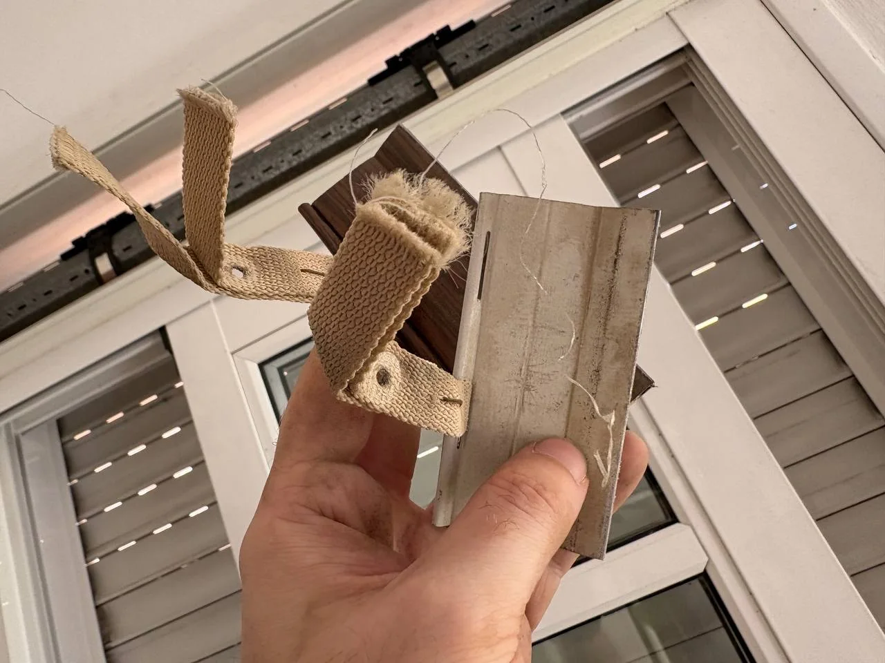
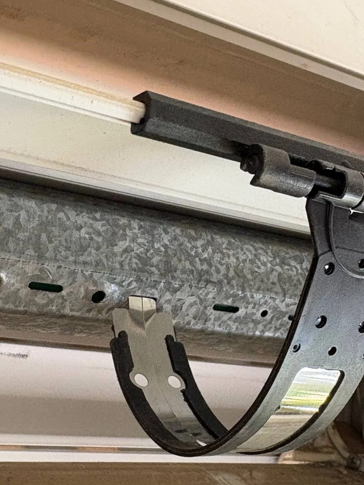
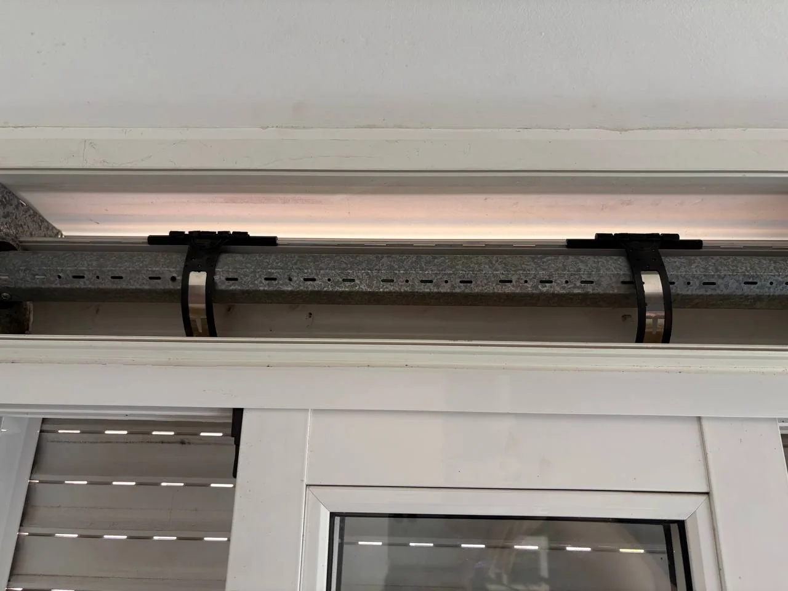

A few days ago I heard a strange noise from one of my electric roller shutters while it was going down

I went quickly to stop it, but it didnt respond anymore. The shutter seemed completely stuck.

When I opened the roller shutter box, I found the curtain rolled in a bad way around the tube. Something had moved inside, the slats were not winding straight, and the roller tube could no longer turn.

Well, not the nicest thing to find, but at least the problem was visible.

> Before putting your hands inside the box, disconnect the shutter from the power, make sure nobody can activate it and support the curtain so it cant fall.

## Finding the Problem

To see what had happened, I carefully removed the shutter from the box, slat by slat, until only the metal roller tube was visible.

And there it was.

One of the old suspension straps had come loose. These are the pieces that connect the top slat of the shutter to the roller tube. When I removed them, it was also clear that the old fabric was already very worn and frayed.

With one strap detached, the curtain was no longer supported evenly. That likely made it move to one side, wind badly and finally get trapped inside the box.

## Why I Could Not Use Screws

There was another detail that did not look very good. Both original straps were grouped on the left side of the roller tube.

I think this was part of the problem. Both straps were pulling from the same side

The problem is that the motor is hidden inside the right side of the roller tube. I could not screw another strap there because the screw could damage the motor inside.

Drilling blindly into a tube with a motor inside sounded like a good way to turn a 5€ repair into a much more expensive one

So I needed hangers that could use the existing rectangular slots in the tube without screws.

## The Screwless Replacement

I found some clipin roller-shutter hangers on Amazon for around 5 bucks. Instead of using screws, they lock into the existing slots in the tube.

The important part was checking that the tabs matched the slots in my tube and that the hangers were compatible with the top slat. The number and spacing can be different for another shutter.

In my case, I inserted the metal tab of each hanger into one of the tube slots and opened it so it stayed fixed in place

Now I could put the hangers in better positions, also on the motor side, without drilling anything.

## Putting the Shutter Back

Once the hangers were fixed, I started putting the shutter back into the box, again slat by slat. I tried to keep both sides aligned so it didn't start rolling crooked again.

When the full curtain was back in place, I connected the new hangers to the top slat.

Before closing the box, I moved my hands and tools away, restored the power and tested it with a short movement. This time it rolled straight and did not get stuck.

Then I put the access cover back.

And... done. Handyman task completed.

## Conclusion

At first, a jammed electric shutter looked like a delicate and complicated repair. In the end, with around five euros, some manual work and a little patience, I fixed it.

Sometimes the idea of opening and fixing something is more complicated than the thing itself. Two new hangers, put everything back in place, and thats it.
