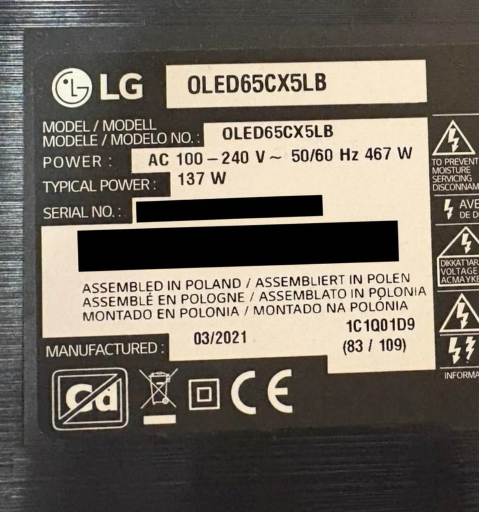
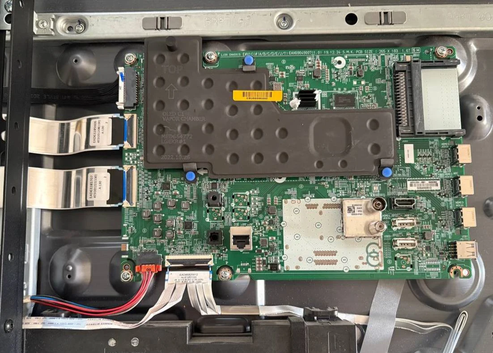
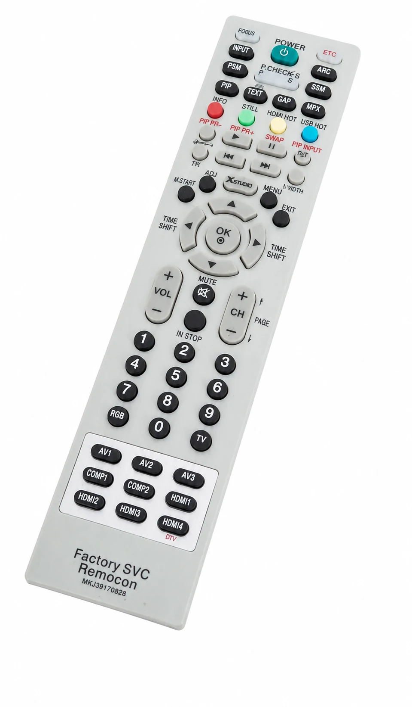

About a year ago I started having a strange problem with my LG OLED65CX5LB TV.

Depending on the content, after a variable amount of time the image became completely corrupted. On some occasions, the TV also produced a high-pitched noise through the speakers

It did not happen with everything or always after the same number of minutes, which made the problem a little more difficult to understand.

This is the exact model of my TV:

After searching for information, everything I found pointed to the chip on the main board overheating.

> A TV can retain dangerous voltage even after it is unplugged. If you open one, disconnect it from the power, wait before touching anything and stay away from the powersupply area. The OLED panel is also very fragile, so do not try this if you are not comfortable working inside electronic devices.

## My First Attempt: Replacing the Thermal Paste

I opened the TV, removed the main board and found that the thermal paste was in pretty bad condition.

I cleaned away the old paste, applied fresh thermal paste and put everything back together

And it helped.

For almost one full year, the TV stopped showing corrupted images or making that horrible high pitched sound.

For some time I thought the repair was done.

## The Problem Came Back

This summer it started happening again.

But this time it was worse. The corrupted image appeared with more types of content, and it happened much sooner.

Well, the new thermal paste had bought me a year, but clearly it had not fixed the real problem forever. I had no choice but to accept it and look for another main board.

## Finding the Correct Main Board

I searched for the identifier of the main board compatible with my exact TV model. It turned out to be `EBU66095002`.

This is the board installed inside the TV, under the large black vapor chamber:

Once I had the reference, I started looking for the component second hand.

That ended up being a mistake.

## The second hand Board Was a Mistake

I bought a used board through Wallapop. The seller said that it was working, but the board I received was completely dead.

I complained to Wallapop, but they washed their hands of it. Their excuse was that they had no way to verify whether a component removed from its original product worked correctly.

So I ended up with a dead board and no money.

My advice after this experience is simple: never buy components like this second-hand. And honestly, I would say do not buy anything second hand at all. There are too many shameless scammers around

## Buying a New Board With a Warranty

After this blow, and after losing a full week, I decided to do it properly and buy from a shop that could give me a warranty.

In my case it was a shop called Repuestos Originales LG. I searched for `EBU66095002`, ordered it and two days later I already had the board at home.

The difference was simple: this time I was buying from a real shop, with a real warranty if the replacement did not work.

## Installing the Replacement

I screwed the new board into the TV and connected all the ribbon cables and connectors again.

Then I plugged in the TV and tested it.

And... yessss. Now it worked perfectly.

No corrupted image, no high-pitched sound. The TV could finally play every type of content again without problems.

## The Last Step: An LG Service Remote

There was only one small thing left.

After replacing the main board, the TV showed an initial configuration menu that I could not remove with the normal remote. For that final step I needed a compatible LG service remote like the `MKJ39170828`.

With that remote I could dismiss the initial configuration menu, and that was it. My TV was like new again.

## Conclusion

Changing the thermal paste gave me almost another year, but in my case the definitive solution was replacing the main board.

The worst part was losing one week and the money on a dead second hand board.

With the correct `EBU66095002` board and the LG service remote, my TV was like new again.

And thats it. One less excuse to buy a new TV.
