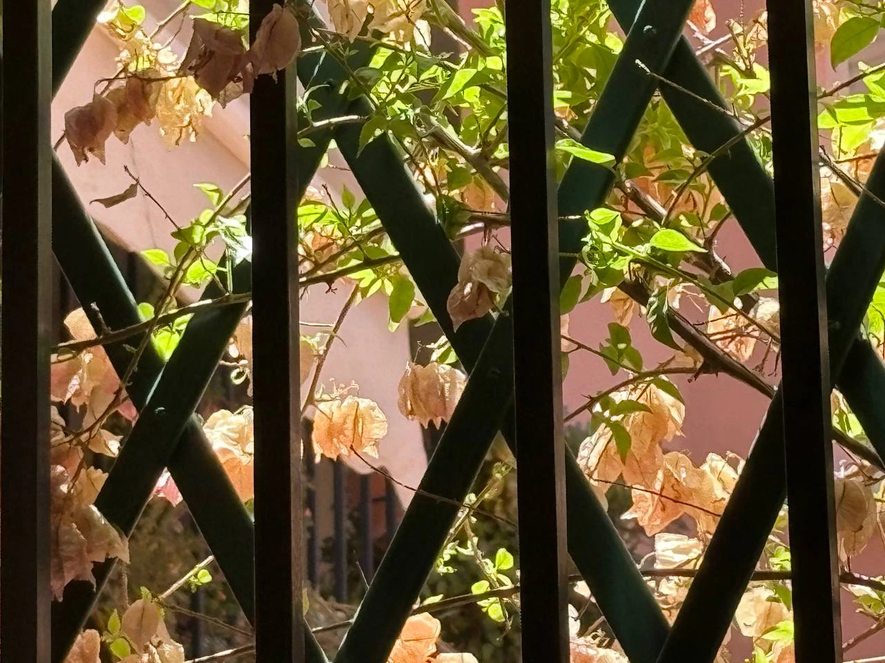

El otro día estaba hablando con un buen amigo mio sobre el poco tiempo que tenemos y lo que nos gustaría hacer si dispusieramos de más tiempo libre. Hablábamos sobre proyectos personales que nos gustaría terminar, libros que querríamos leer o sitios que visitar, pero mientras sacabamos mas y mas cosas, algo cruzó mi mente; **escribir**

No es raro el decir, tengo que leer mas, ir mas al cine o muchas otras cosas, pero pocas son las veces que decimos; **tengo que escribir más**. Es cierto que escribimos sin parar en el día a día, en el trabajo, a nuestros amigos por whatsapp e incluso en las redes sociales pero, ¿hasta que punto eso es escribir?, **es como si cuando nos refirieramos a leer, pensaramos en leer las instrucciones del horno**. Escribimos pero por necesidad u obligación casi siempre, sin pararnos en el mero significado de las palabras o lo que queremos contar.

Ahora mismo no busco contar nada, tampoco quiero sacar ninguna conclusión ni siquiera reflexionar, bueno, quizás reflexionar si, pero sin objetivo. Me gustaria escribir simplemente porque no lo suelo hacer fuera de mi rutina, porque quizás escribiendo consiga conocerme mas a mi mismo, una escritura sin objetivo claro mas hayá de la auto reflexión o darle salida a una idea sin mas pretensión que plasmarla de manera escrita. No se, quizás lo haga, escribir, sin objetivo, como cuando miro **_la buganvilla a traves de mi ventana_**.

