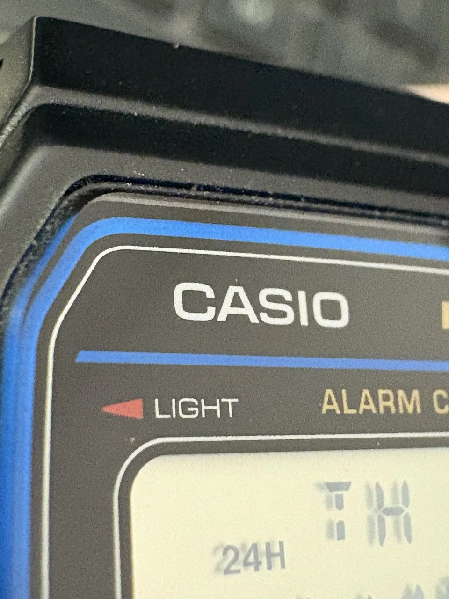

Mas de un año llevo sin reloj, desde que mi último Apple Watch petó justo fuera de garantía. Se ve que soy demasiado aficionado a los deportes de agua en el mar y aunque el relojito inteligente tiene modo "nadar en aguas abiertas", parece que se refiere a nadar en agua no conductora que no afecte a dispositivos electronicos. La cosa es que el último verano el smart watch dijo hasta aquí llego, y decidio que no iba a funcionar más.

**Era el segundo Apple Watch que se me rompía en similares circunstancias**. Me pude autoengañar la primera vez. Me decia a mi mismo, bueno, ya han pasado 3 años, no está mal, y me compré el ultimo modelo que correspondía, pero tras otres 3 años, tratarlo como oro en paño y que petase de la misma manera pues ya me hicieron saltar las alarmas y decidí mandar a tomar viento a los relojes de la manzanita.

El caso es que todo este tiempo he estado mirando de vez en cuando los relojes inteligentes del mercado, intentandome decidirme por uno o por otro. Repasaba de memoria mis necesidades, aunque, como pasa siempre, cuantas mas funcionalidades mejor.

- ¿Pago con tarjeta? 
- _Lo quiero_ 
- ¿Diferentes modos de ejercicio? 
- _Lo quiero_ 
- ¿Pulsioximetro? 
- _Lo quiero_ 
- ¿Que me cuente ovejitas mientras me canta una nana para dormir y luego mida cuanto tiempo paso en la fase REM en la ROM y en la HDD? 
- _No lo quiero, **¡lo necesito!**_

Hasta que, de repente, salí del trance. Para que necesito tantas tonterías en un dispositivo con autonomia de un dia y poco. **¿La funcionalidad de un puñetero reloj no deberia ser simplemente poder mirar la hora y poner alguna alarma como máximo alarde de tecnología?** En estas estaba cuando vi una oferta de un CASIO como el antiguo reloj que llevaba de pequeño/adolescente por 10 eurillos. Un CASIO F-91W, negro, correa de plastico duro, 24/12h, alarma, cronometro y hasta una lucecita para ver la hora a oscuras y una pila que durara decadas antes de gastarse.

Solo necesité cargarme 2 apple watch para llegar a la conclusión logica y razonable, quiero que mi reloj solo relojee. Hoy en dia tendriamos que valorar mas la simplicidad y no enredarnos mas en tecnología sin sentido. Como ya se decia en ese eslogan de ruedas, **"la potencia sin cotrol no sirve de nada"** pues eso mismo pasa con la tecnologia que añadimos a nuestra vida, no por meter mas, nos va a facilitar ni a ayudar en nada.

