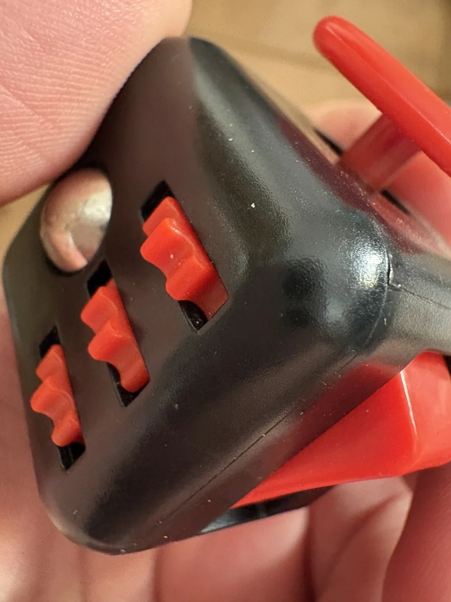

Cuando estábamos en los albores de las inteligencias Artificiales, con aquel lejano GPT3.5, la IA no pasaba de parecerme una curiosidad, algo entretenido, con aparente potencial, pero que en aquel momento no servía más que para hacerte el chulo y decir que en el futuro todo lo hará la IA. Mucho ha llovido desde entonces y creo que podemos decir sin temor a equivocarnos que ahora sí la inteligencia artificial ha marcado un **AIntes y un después**.

Poco a poco, modelo a modelo, la IA ha ido ganando un puesto preferente como herramienta de uso cotidiano. Al principio era simplemente una forma más de buscar, análoga a usar el buscador de Google.

Poco a poco dejé de buscar respuestas en Google y empecé a preguntarle directamente a ChatGPT. Al final me evitaba la parte de tener que ir de resultado en resultado, procesando y eligiendo la mejor respuesta.

Al cabo de un tiempo empecé a usarla en mi trabajo como compañera para agilizar mis flujos: *documéntame este código*, *hazme una función estándar para estas dos funcionalidades, que tienen muchas similitudes*. La clave era que me facilitaba la vida y me servía como compañera para discutir opciones y no solo para picar código.

## La evolución de la IA

La IA ha pasado de una mera curiosidad a **una herramienta imprescindible** si quieres ser dinámico en lo que haces.

Al principio la IA no era más que un mero entretenimiento; era gracioso preguntarle cosas, pero su utilidad real era limitada. Tras cada modelo, la IA ha demostrado su valía y que es una herramienta que, como todo, bien usada, proporciona un potencial enorme.

He completado en días proyectos de desarrollo de software que llevarían semanas; me ha enseñado temarios de asignaturas complejas como el mejor de los profesores; me asesora sobre cuestiones técnicas, legales o de lo que sea en cuestión de segundos. La clave es **no usarla como fuente de verdad absoluta**, sino como herramienta para llegar a esa verdad, porque la IA se equivoca.

## La importancia de las buenas instrucciones y restricciones

Todo resultado que da una IA es no determinista. Por lo tanto, se hace esencial ser lo más exactos posible tanto en las instrucciones que le damos para llegar a un resultado como en las restricciones que debe cumplir el resultado que nos da la IA y las pruebas que debe pasar. En ese y no en ningún otro lugar reside la clave que determina si la IA nos es útil o no.

No es que la IA nos dé malos resultados o haga mal su trabajo; por norma general, el fallo está en nuestras instrucciones y en los tests que aplicamos a los resultados. Si somos descuidados a la hora de definir lo que queremos, la IA rellenará los huecos que hemos dejado y puede que, con esto, el resultado no se adapte a lo que queríamos.

Por eso siempre hay que tener en mente que **cuanto más concisos, organizados y estructurados seamos, mejor responderá la IA**. No tenemos que olvidar que, aunque no lo parezca, la IA no es más que un algoritmo informático y, como en todo, cuanto más estructurado sea nuestro *input*, mejor *output* tendremos.

## La IA es una herramienta, no sustituye tu cerebro

Usar una IA no implica que tengas que tragarte sin filtro todos sus resultados. Como persona, **tú eres el último responsable** de usar o no lo que ha producido. Si no vas a revisar cada resultado que genera la IA, tienes que preocuparte muy mucho de crear tests, restricciones o revisiones exactas de lo que genera porque, aunque la IA no es humana, se equivoca como nosotros.

La inteligencia artificial no es una herramienta determinista. Por eso, más que nunca, recae sobre nosotros la tarea de comprobar sus resultados. Hay veces que es sencillo y hay veces que la usamos en flujos en los que el contenido se genera tan rápido que la revisión humana solo ralentizaría el proceso.

Para eso hay herramientas: tests automáticos, lo que sea. Vale que una persona no revise manualmente todo lo que genera la IA; quizás no es necesario, pero sí es necesario que una persona sea responsable de la herramienta. Incluso en las producciones industriales más grandes siempre hay una persona supervisando, porque las máquinas se equivocan, los sensores arrojan resultados falsos y, en definitiva, siempre tiene que ser una persona quien apriete el botón y decida.

## La tendremos en todos lados

Hay gente que aún no la usa o cree que en su nicho no tiene sentido. Se equivocan. La IA ayuda en prácticamente todo lo que hacemos; los únicos aspectos que fallan son la integración y la reticencia de algunas personas que creen que es un peligro para su trabajo o posición.

**La IA no nos va a quitar el trabajo, sino simplemente a modificarlo.** Ya hemos vivido otras revoluciones similares en las que ciertos trabajos dejan de tener sentido por la propia evolución de la técnica o la tecnología, y esta vez será igual.

La IA nos transformará y dejará obsoletos trabajos, pero creará muchos otros; quizá deje de haber valor en picar código, pero nunca dejará de haber valor en un ingeniero que implemente soluciones, aunque ya este ingeniero delegue la implementación completa a una IA.

## Un AIntes y un después

Desconozco adónde nos llevará la IA, pero lo que está claro es que **el cambio ya ha empezado y no usarla es quedarte atrás**. Puede que los cambios se queden aquí; puede que el precio de usarla suba por las nubes, pero, independientemente de ello, es una tecnología que ha llegado para quedarse.

Para rematar, solo quiero decir que no es momento de ser recelosos ni de atrincherarse en el «yo no uso la IA porque...». Lo importante ahora no es dejar patentes sus puntos débiles, sino usar sus puntos fuertes y aplicarlos a lo que haces en el día a día.

No tiene por qué ser solo trabajo. ¿Quieres aprender una materia o quieres saber cómo hacer algún arreglo en tu casa? La IA es la mejor compañera ahora mismo para la mayoría de cosas que se te ocurran, pero recuerda: tú eres la persona responsable que hay detrás.
